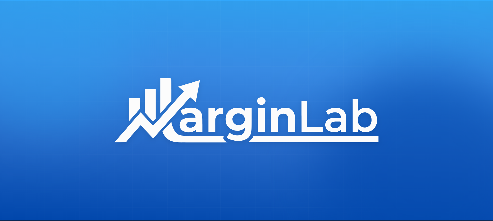

  

  
  

 

Este proyecto es la evolución de un software utilizado internamente por una empresa del sector de la construcción y reformas. Su objetivo es permitir a los comerciales calcular márgenes de beneficio complejos y gestionar presupuestos con precisión milimétrica.

## 🎯 ¿Qué soluciona esta herramienta?

En el sector de la construcción, calcular el precio final de un artículo es complejo debido a las múltiples variables que afectan al coste (descuentos en cadena, costes de transporte, rappels anuales, etc.).

**MarginLab** automatiza estos cálculos para evitar errores humanos y proteger la rentabilidad:
* **Cálculo de costes en cascada:** Gestiona descuentos compuestos (Factura + Pronto Pago + Rappel).
* **Semáforo de Rentabilidad:** Un sistema visual alerta si un producto se vende por debajo del coste o si el margen es insuficiente.
* **Control de Versiones:** Permite crear múltiples iteraciones de un mismo presupuesto sin perder el historial.

## 🔓 Cómo funciona esta Demo: Tu Espacio Privado

El mayor reto de este proyecto fue transformar una herramienta empresarial (que requiere registro y permisos) en una **web pública accesible para todos**, pero manteniendo la privacidad de los datos.

Para lograrlo, he desarrollado un sistema de **"Sesiones Privadas Automáticas"**:

1.  **Sin Registro:** No necesitas crear una cuenta ni dar tu email. Simplemente pulsas el botón de arriba.
2.  **Tu Copia Personal:** Al entrar, el sistema crea instantáneamente una copia única y aislada de la base de datos solo para ti.
3.  **Aislamiento Total:** Lo que edites, borres o calcules solo lo ves tú. Ningún otro visitante puede acceder a tus presupuestos ni ver tus cambios.
4.  **Memoria Inteligente:** Puedes cerrar el navegador y volver días después; el sistema reconocerá tu dispositivo y te devolverá a tu trabajo exactamente donde lo dejaste.

## ⚙️ Arquitectura Técnica

El proyecto ha sido reescrito siguiendo estándares de desarrollo modernos y limpios:

* **Lenguaje:** PHP Nativo (Sin frameworks) con Arquitectura Modular.
* **Base de Datos:** MySQL con gestión eficiente de conexiones (PDO).
* **Frontend:** JavaScript Puro (Vanilla JS) para cálculos en tiempo real en el cliente.
* **Diseño:** Interfaz responsiva y orientada a la productividad.

---

    <i>Proyecto desarrollado con fines demostrativos de arquitectura software y experiencia de usuario.</i>

